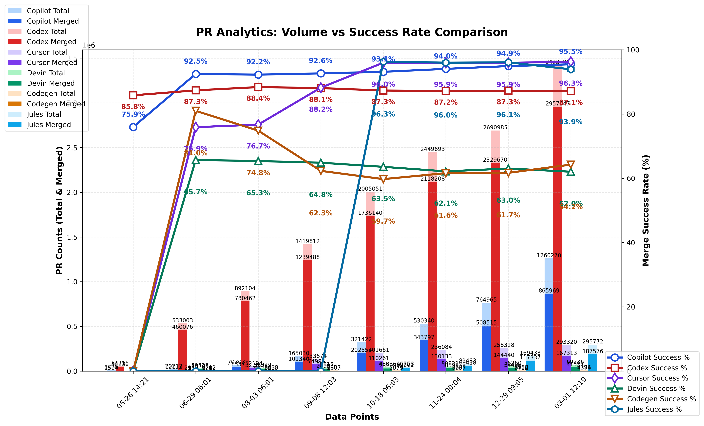

### PR Analytics: Volume vs Success Rate (auto-updated)

View the [interactive dashboard](https://prarena.ai) for these statistics.

## Understanding the Metrics

Different AI coding agents follow different workflows when creating pull requests:

- **All PRs**: Every pull request created by an agent, including DRAFT PRs
- **Ready PRs**: Non-draft pull requests that are ready for review and merging
- **Merged PRs**: Pull requests that were successfully merged into the codebase

**Key workflow differences**: Some agents like **Codex** iterate privately and create ready PRs directly, resulting in very few drafts but high merge rates. Others like **Copilot** and **Codegen** create draft PRs first, encouraging public iteration before marking them ready for review.

The statistics below focus on **Ready PRs only** to fairly compare agents across different workflows, measuring each agent's ability to produce mergeable code regardless of whether they iterate publicly (with drafts) or privately.

## Data sources

Explore the GitHub search queries used:

- **All Copilot PRs**: [https://github.com/search?q=is:pr+head:copilot/&type=pullrequests](https://github.com/search?q=is:pr+head:copilot/&type=pullrequests)
- **Merged Copilot PRs**: [https://github.com/search?q=is:pr+head:copilot/+is:merged&type=pullrequests](https://github.com/search?q=is:pr+head:copilot/+is:merged&type=pullrequests)
  

- **All Codex PRs**: [https://github.com/search?q=is:pr+head:codex/&type=pullrequests](https://github.com/search?q=is:pr+head:codex/&type=pullrequests)
- **Merged Codex PRs**: [https://github.com/search?q=is:pr+head:codex/+is:merged&type=pullrequests](https://github.com/search?q=is:pr+head:codex/+is:merged&type=pullrequests)
  

- **All Cursor PRs**: [https://github.com/search?q=is:pr+head:cursor/&type=pullrequests](https://github.com/search?q=is:pr+head:cursor/&type=pullrequests)
- **Merged Cursor PRs**: [https://github.com/search?q=is:pr+head:cursor/+is:merged&type=pullrequests](https://github.com/search?q=is:pr+head:cursor/+is:merged&type=pullrequests)
  

- **All Devin PRs**: [https://github.com/search?q=is:pr+author:devin-ai-integration[bot]&type=pullrequests](https://github.com/search?q=is:pr+author:devin-ai-integration[bot]&type=pullrequests)
- **Merged Devin PRs**: [https://github.com/search?q=is:pr+author:devin-ai-integration[bot]+is:merged&type=pullrequests](https://github.com/search?q=is:pr+author:devin-ai-integration[bot]+is:merged&type=pullrequests)
  

- **All Codegen PRs**: [https://github.com/search?q=is:pr+author:codegen-sh[bot]&type=pullrequests](https://github.com/search?q=is:pr+author:codegen-sh[bot]&type=pullrequests)
- **Merged Codegen PRs**: [https://github.com/search?q=is:pr+author:codegen-sh[bot]+is:merged&type=pullrequests](https://github.com/search?q=is:pr+author:codegen-sh[bot]+is:merged&type=pullrequests)
  

- **All Jules PRs**: [https://github.com/search?q=is:pr+author:google-labs-jules[bot]&type=pullrequests](https://github.com/search?q=is:pr+author:google-labs-jules[bot]&type=pullrequests)
- **Merged Jules PRs**: [https://github.com/search?q=is:pr+author:google-labs-jules[bot]+is:merged&type=pullrequests](https://github.com/search?q=is:pr+author:google-labs-jules[bot]+is:merged&type=pullrequests)
  

---

## Current Statistics

| Project | Ready PRs | Merged PRs | Success Rate |
| ------- | --------- | ---------- | ------------ |
| Copilot | 215,454 | 200,616 | 93.11% |
| Codex | 1,979,604 | 1,728,384 | 87.31% |
| Cursor | 114,335 | 109,745 | 95.99% |
| Devin | 44,003 | 27,931 | 63.48% |
| Codegen | 4,962 | 2,961 | 59.67% |
| Jules | 36,574 | 35,203 | 96.25% |