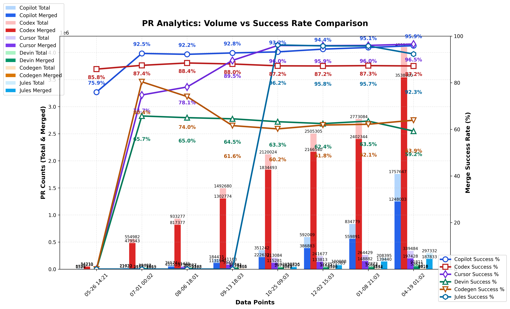

  

    
🌐 Language

    

      

        
<a href="https://openaitx.github.io/view.html?user=aavetis&project=PRarena&lang=en">English</a>

        
<a href="https://openaitx.github.io/view.html?user=aavetis&project=PRarena&lang=zh-CN">简体中文</a>

        
<a href="https://openaitx.github.io/view.html?user=aavetis&project=PRarena&lang=zh-TW">繁體中文</a>

        
<a href="https://openaitx.github.io/view.html?user=aavetis&project=PRarena&lang=ja">日本語</a>

        
<a href="https://openaitx.github.io/view.html?user=aavetis&project=PRarena&lang=ko">한국어</a>

        
<a href="https://openaitx.github.io/view.html?user=aavetis&project=PRarena&lang=hi">हिन्दी</a>

        
<a href="https://openaitx.github.io/view.html?user=aavetis&project=PRarena&lang=th">ไทย</a>

        
<a href="https://openaitx.github.io/view.html?user=aavetis&project=PRarena&lang=fr">Français</a>

        
<a href="https://openaitx.github.io/view.html?user=aavetis&project=PRarena&lang=de">Deutsch</a>

        
<a href="https://openaitx.github.io/view.html?user=aavetis&project=PRarena&lang=es">Español</a>

        
<a href="https://openaitx.github.io/view.html?user=aavetis&project=PRarena&lang=it">Itapano</a>

        
<a href="https://openaitx.github.io/view.html?user=aavetis&project=PRarena&lang=ru">Русский</a>

        
<a href="https://openaitx.github.io/view.html?user=aavetis&project=PRarena&lang=pt">Português</a>

        
<a href="https://openaitx.github.io/view.html?user=aavetis&project=PRarena&lang=nl">Nederlands</a>

        
<a href="https://openaitx.github.io/view.html?user=aavetis&project=PRarena&lang=pl">Polski</a>

        
<a href="https://openaitx.github.io/view.html?user=aavetis&project=PRarena&lang=ar">العربية</a>

        
<a href="https://openaitx.github.io/view.html?user=aavetis&project=PRarena&lang=fa">فارسی</a>

        
<a href="https://openaitx.github.io/view.html?user=aavetis&project=PRarena&lang=tr">Türkçe</a>

        
<a href="https://openaitx.github.io/view.html?user=aavetis&project=PRarena&lang=vi">Tiếng Việt</a>

        
<a href="https://openaitx.github.io/view.html?user=aavetis&project=PRarena&lang=id">Bahasa Indonesia</a>

      

    

  

### PR Analytics: Volume vs Success Rate (auto-updated)

View the [interactive dashboard](https://prarena.ai) for these statistics.

## Understanding the Metrics

Different AI coding agents follow different workflows when creating pull requests:

- **All PRs**: Every pull request created by an agent, including DRAFT PRs
- **Ready PRs**: Non-draft pull requests that are ready for review and merging
- **Merged PRs**: Pull requests that were successfully merged into the codebase

**Key workflow differences**: Some agents like **Codex** iterate privately and create ready PRs directly, resulting in very few drafts but high merge rates. Others like **Copilot** and **Codegen** create draft PRs first, encouraging public iteration before marking them ready for review.

The statistics below focus on **Ready PRs only** to fairly compare agents across different workflows, measuring each agent's ability to produce mergeable code regardless of whether they iterate publicly (with drafts) or privately.

## Data sources

Explore the GitHub search queries used:

- **All Copilot PRs**: [https://github.com/search?q=is:pr+head:copilot/&type=pullrequests](https://github.com/search?q=is:pr+head:copilot/&type=pullrequests)
- **Merged Copilot PRs**: [https://github.com/search?q=is:pr+head:copilot/+is:merged&type=pullrequests](https://github.com/search?q=is:pr+head:copilot/+is:merged&type=pullrequests)
  

- **All Codex PRs**: [https://github.com/search?q=is:pr+head:codex/&type=pullrequests](https://github.com/search?q=is:pr+head:codex/&type=pullrequests)
- **Merged Codex PRs**: [https://github.com/search?q=is:pr+head:codex/+is:merged&type=pullrequests](https://github.com/search?q=is:pr+head:codex/+is:merged&type=pullrequests)
  

- **All Cursor PRs**: [https://github.com/search?q=is:pr+head:cursor/&type=pullrequests](https://github.com/search?q=is:pr+head:cursor/&type=pullrequests)
- **Merged Cursor PRs**: [https://github.com/search?q=is:pr+head:cursor/+is:merged&type=pullrequests](https://github.com/search?q=is:pr+head:cursor/+is:merged&type=pullrequests)
  

- **All Devin PRs**: [https://github.com/search?q=is:pr+author:devin-ai-integration[bot]&type=pullrequests](https://github.com/search?q=is:pr+author:devin-ai-integration[bot]&type=pullrequests)
- **Merged Devin PRs**: [https://github.com/search?q=is:pr+author:devin-ai-integration[bot]+is:merged&type=pullrequests](https://github.com/search?q=is:pr+author:devin-ai-integration[bot]+is:merged&type=pullrequests)
  

- **All Codegen PRs**: [https://github.com/search?q=is:pr+author:codegen-sh[bot]&type=pullrequests](https://github.com/search?q=is:pr+author:codegen-sh[bot]&type=pullrequests)
- **Merged Codegen PRs**: [https://github.com/search?q=is:pr+author:codegen-sh[bot]+is:merged&type=pullrequests](https://github.com/search?q=is:pr+author:codegen-sh[bot]+is:merged&type=pullrequests)
  

---

## Current Statistics

| Project | Ready PRs | Merged PRs | Success Rate |
| ------- | --------- | ---------- | ------------ |
| Copilot | 25,332 | 23,181 | 91.51% |
| Codex | 722,207 | 635,619 | 88.01% |
| Cursor | 20,244 | 15,405 | 76.1% |
| Devin | 30,324 | 19,910 | 65.66% |
| Codegen | 2,410 | 1,851 | 76.8% |